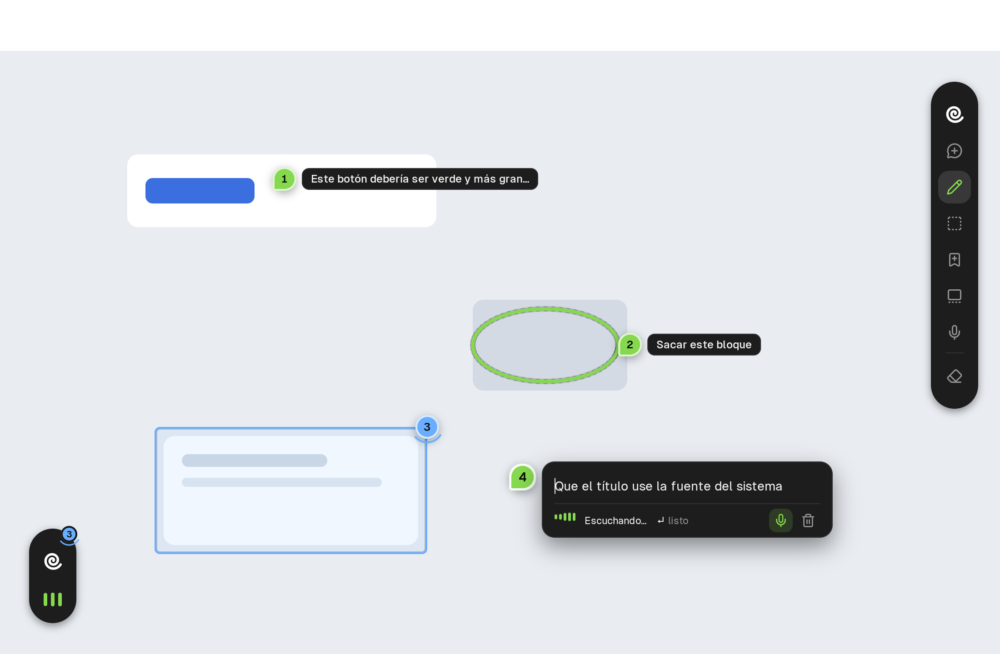

# hook

<p align="center"><b>Señalá tu pantalla y decile a tu agente de código qué cambiar.</b></p>

hook es un widget flotante nativo que se queda en tu escritorio mientras trabajás. Cuando algo no te
cierra (un botón, un texto, un bloque que sobra), lo marcás directo sobre la pantalla con un comentario,
un trazo o un área. hook guarda la marca con su posición exacta y una captura silenciosa del monitor, y
se la entrega a Claude Code, a Codex o a cualquier agente compatible con MCP para que haga el cambio.

<p align="center"></p>

## Cómo se usa

1. **Tocá la píldora** o apretá `Ctrl+Alt+K`. Las herramientas se despliegan desde ella. Para moverla, arrastrala
   desde el logo, cerrada o abierta.
2. **Elegí una herramienta** y marcá en cualquier monitor:
   - **Comentar** (`C`): un click deja un pin y abre el globo. Escribís y apretás `Enter`. Con
     `Shift+Enter` la herramienta queda armada y encadenás comentarios: click, escribís, `Shift+Enter`,
     click…
   - **Dibujar** (`D`): arrastrás un trazo libre sobre lo que querés señalar.
   - **Marcar área** (`A`): arrastrás un recuadro, o hacés **un solo click** sobre un elemento (un botón,
     una tarjeta, un panel) y hook detecta su borde solo. Con la **rueda del mouse** agrandás la selección
     al elemento que lo contiene, o la achicás.
   - **Guardar memory** (`M`): arrastrás un recuadro (o hacés un click, como en Marcar área) sobre algo que te gusta (un botón, una tarjeta, un
     layout, de cualquier app o web) y le ponés un nombre. Podés sumar una nota después de dos puntos:
     `tarjeta linear: el borde suave`. Queda guardada como referencia, no como feedback.
   - **Dictar comentario** (`V`): un click deja el pin y el globo ya te escucha; las barras verdes siguen
     tu voz. `Enter` corta, hook transcribe en tu máquina y el texto cae en el globo para revisarlo y
     guardarlo con otro `Enter`. El botón del micrófono en cualquier globo también dicta. La primera vez
     descarga el modelo de voz (whisper `small`, ~190 MB) a `~/.local/share/hook/models`; nada sale de tu
     equipo después.
3. **Listo.** La herramienta se aparta sola y seguís usando tus apps. La pantalla nunca se congela: las
   marcas quedan flotando encima y solo reciben clicks justo sobre ellas, para editarlas o borrarlas.
   Con el dock cerrado solo se ven los números; el texto aparece al pasar el mouse.
   Un click en una marca abre su **hilo**: la conversación con el agente y un campo para responder.
4. **Usá tus memories.** Con `Ctrl+Alt+M` (o **Memories** en el dock) se abre un buscador con
   miniaturas: elegís una con las flechas, escribís qué querés ("este header en mi landing") y se lo
   manda al agente con la imagen. También podés nombrarla en cualquier comentario: `como @tarjeta-linear`.
5. **Pedile al agente** que aplique el feedback de hook. La píldora muestra cuántas marcas están
   pendientes y se pone azul mientras el agente trabaja. Cuando el agente resuelve una marca, desaparece
   con un fundido. Si no quedó como querías, hacé click en el "✓ …" antes de que se vaya: la marca se
   reabre y le contestás al agente ("no, así no…") con todo el hilo.

| Atajo | Acción |
|---|---|
| `Ctrl+Alt+K` | Abre o cierra las herramientas (atajo global) |
| `Ctrl+Alt+M` | Abre el buscador de memories (atajo global) |
| `C` · `D` · `A` · `M` · `V` | Comentar, dibujar, marcar área, guardar memory, dictar |
| `Enter` | Guarda el comentario |
| `Shift+Enter` | Guarda y deja la herramienta lista: el próximo click abre el siguiente comentario |
| `Esc` | Cancela la herramienta o el comentario, o cierra las herramientas |
| `Ctrl+Q` | Cierra hook (con una ventana de hook enfocada) |

Desde la terminal:

```bash
hook            # abre el widget
hook toggle     # abre o cierra las herramientas
hook memories   # abre el buscador de memories
hook show       # vuelve a mostrar la píldora si la ocultaste
hook hide       # oculta la píldora
hook quit       # cierra hook
```

### Configurar el dictado

En `prefs.json` (en `~/.local/share/hook/`, junto a tus sesiones):

```json
{
  "voice_lang": "es",
  "voice_context": "Hablo en español rioplatense, con voseo: vos querés, fijate. Mi proyecto se llama Café Orbital.",
  "voice_model": "small",
  "voice_server": "https://mi-servidor/v1/audio/transcriptions"
}
```

- `voice_lang`: idioma que hablás (`es` por defecto).
- `voice_context`: cómo hablás y qué palabras usás (tu acento, nombres de tu proyecto, términos técnicos).
  Ayuda a que escriba bien los nombres y el voseo.
- `voice_model`: `small` (~190 MB, rápido) o `turbo` (whisper `large-v3-turbo`, ~550 MB, la mitad de
  errores pero unos 5 s de espera sin GPU). También acepta la ruta a otro modelo `ggml` de whisper.cpp.
- `voice_server`: si lo ponés, el audio va a ese servidor en vez de transcribirse local (compatible con la
  API de transcripción de OpenAI y con `whisper-server`). El token va en la variable de entorno
  `HOOK_VOICE_TOKEN`, nunca en el archivo. Tené en cuenta que el audio sale de tu equipo.

## Conectarlo a tu agente

`hook-mcp` es un servidor MCP por stdio que lee las marcas guardadas y se las muestra al agente.

**Claude Code**

```bash
claude mcp add hook -s user -- /ruta/a/hook/target/release/hook-mcp
```

**Codex** (`~/.codex/config.toml`)

```toml
[mcp_servers.hook]
command = "/ruta/a/hook/target/release/hook-mcp"
```

Herramientas que expone:

| Tool | Qué hace |
|---|---|
| `hook_list_feedback` | Lista las marcas abiertas con texto, monitor y coordenadas. Es barata: no envía imágenes. |
| `hook_get_feedback` | Entrega una sesión con la captura anotada, un recorte ampliado por marca y el JSON de las marcas (en píxeles lógicos y físicos). Si una marca usa una memory (desde el buscador o con `@nombre`), también adjunta su imagen. Las marcas pasan a *tomadas*. |
| `hook_wait_feedback` | Espera a que termines una tanda de marcas (cerrás el dock, o dejás de marcar un momento y no estás escribiendo) y la devuelve. Nunca se lleva un comentario a medio escribir. Sirve para trabajar en loop: marcás y el agente reacciona. |
| `hook_ask` | El agente te pregunta algo sobre una marca ambigua. La pregunta aparece en azul junto a la marca; respondés en el hilo de la marca y vuelve al agente con toda la conversación. |
| `hook_reply` | El agente suma un mensaje al hilo de una marca sin cerrarla. |
| `hook_list_memories` | Lista tus memories (nombre, nota, tamaño). Es barata: no envía imágenes. |
| `hook_get_memory` | Entrega una memory por nombre o `@id`, con su imagen completa y tu nota. |
| `hook_resolve` | Marca como resueltas una o varias marcas, con una nota que ves en pantalla ("✓ …") antes de que la marca desaparezca. |

Un pedido típico: *"aplicá el feedback de hook"* o *"esperá mi próximo comentario en hook y resolvelo"*.

## Instalación

hook está escrito en Rust. Dibuja su UI con `hook-ui`, un motor mínimo propio derivado de
[sherpa](https://github.com/hor4z/sherpa): wgpu sobre Vulkan, Metal o DirectX 12, con texto e íconos
propios. No necesita otros repos para compilar.

```bash
cargo build --release
./target/release/hook
```

Para compilar whisper.cpp (el dictado) hace falta `cmake`. En Linux, además, los headers de PipeWire,
ALSA y libclang:

```bash
sudo apt install cmake libpipewire-0.3-dev libspa-0.2-dev libasound2-dev libclang-dev
```

Para **correrlo** alcanza con `libpipewire-0.3` y `libasound2`, que ya vienen en cualquier escritorio moderno (Ubuntu
22.10+, Fedora 34+, Debian 12).

La primera vez que se abre en Linux, hook:
- se registra como aplicación (`dev.hook.Hook`) con su ícono en `~/.local/share/applications`;
- agrega los atajos `Ctrl+Alt+K` y `Ctrl+Alt+M` a los atajos personalizados de GNOME.

## Cómo funciona

```
crates/hook-core   modelo de marcas y sesiones, almacenamiento en disco, imágenes (PNG, recortes)
crates/hook-app    binario `hook`: píldora, dock y overlays con sherpa + wgpu, captura, atajos, IPC
crates/hook-mcp    binario `hook-mcp`: servidor MCP por stdio
crates/hook-ui     motor de UI mínimo (recorte de sherpa: núcleo, texto, painter wgpu, campo de texto)
```

- **Ventanas:**
  - Un único overlay transparente que cubre todo el escritorio (todos los monitores) y la píldora,
    siempre encima. El dock nace de la píldora con una transformación continua.
  - El input de cada overlay se recorta al píxel: solo el dock, las marcas y el globo reciben clicks, y
    el resto de la pantalla sigue funcionando.
  - Con 1, 2 o más monitores, cada marca sabe en qué monitor está.
- **Captura:**
  - Se toma cuando guardás una marca, sin diálogos, sonido ni flash.
  - Guarda la imagen real del escritorio tal como la ves, con tus marcas encima.
  - En GNOME usa la API de ScreenCast de Mutter con PipeWire: unos 100 ms por captura.
- **Datos:**
  - Cada sesión vive en `~/.local/share/hook/sessions/<id>/`, con `session.json`, `annotated.png`
    (más `preview.png` si es grande) y un recorte `crop-<n>.png` por marca.
  - Cada marca pasa por `pendiente → tomada → resuelta`.
- **Control:**
  - La app escucha en un socket local (`$XDG_RUNTIME_DIR/hook/hook.sock`, con permisos 0600).
  - Lo usan el subcomando `hook toggle` y el MCP.

## Estado

| Plataforma | Estado |
|---|---|
| Linux, GNOME en Wayland | ✅ Probado con dos monitores. Las ventanas corren por XWayland, que viene con GNOME, porque GNOME no permite overlays siempre encima a clientes Wayland. Con `HOOK_WAYLAND=1` se fuerza Wayland puro (experimental). |
| Linux, X11 | Debería funcionar igual. Falta probarlo. |
| macOS | Sin probar. El código tiene las ramas por plataforma, pero falta compilarlo, sumar el hit-test por zonas y pedir el permiso de grabación de pantalla. |
| Windows | Sin probar. Falta compilarlo y sumar el hit-test por zonas. |

Próximos pasos:
- **Contexto semántico:** que el agente reciba qué elemento, selector y componente marcaste (accesibilidad
  del sistema y una extensión del navegador), y usar la captura solo como apoyo.
- **Voz:** las barras de la píldora siguiendo el micrófono, y hablar mientras señalás, con transcripción
  local.
- Seguimiento visual de marcas, para que no se corran cuando cambia lo que hay debajo.
- Más ideas en [`docs/IDEAS.md`](docs/IDEAS.md).
- Opción para salir desde el dock y compañero de GNOME Shell
  (borrador en `gnome/`) para Wayland puro.

## Playground

`playground/` es una app de prueba (React + Vite con HMR, "Café Orbital") para ejercitar el ciclo
completo: marcás algo, el agente lo cambia y lo ves al instante.

```bash
cd playground && npm install && npm run dev      # http://localhost:5173
```

## Desarrollo

```bash
cargo test --workspace                           # tests de hook-core y hook-mcp
./target/release/hook --preview out.png          # renderiza la escena de ejemplo en la GPU, sin ventanas
./target/release/hook --probe                    # diagnóstico: monitores, captura, ventanas e input (sin guardar imágenes)
./target/release/hook --suite                    # batería de escenarios con clicks y teclas simulados (X11)
./target/release/hook --stress 3                 # estrés sobre ventanas X11 de Café Orbital en cada monitor
./target/release/hook --mark "0.3,0.4,texto"     # deja un comentario en una fracción de la ventana de Café Orbital
./target/release/hook --morph out.png            # tira de cuadros de la animación píldora → dock
./target/release/hook --listen 5                 # graba 5 s del micrófono y muestra lo transcrito
./target/release/hook --transcribe audio.wav     # transcribe un archivo (necesita ffmpeg)
HOOK_VOICE_FILE=audio.wav ./target/release/hook  # el dictado usa ese audio en vez del micrófono (lo usa --suite)
./target/release/hook --record 10 frase.wav      # graba 10 s del micrófono a un archivo (para el benchmark)
HOOK_WHISPER_MODEL=turbo ./target/release/hook   # HOOK_VOICE_LANG, _PROMPT, _SERVER y HOOK_WHISPER_MODEL pisan prefs.json
HOOK_DEBUG=1 ./target/release/hook               # registra tamaños y monitores de las ventanas
```

- **Estilo:** igual que sherpa, con `rustfmt` a 200 columnas, sin comentarios en el código, código en
  inglés y textos de la interfaz en español.
- **`--e2e`:** mueve el puntero y escribe de verdad. Solo hace click sobre zonas que pertenecen a hook y
  solo escribe si el foco está en hook, pero conviene no tocar el mouse mientras corre.
